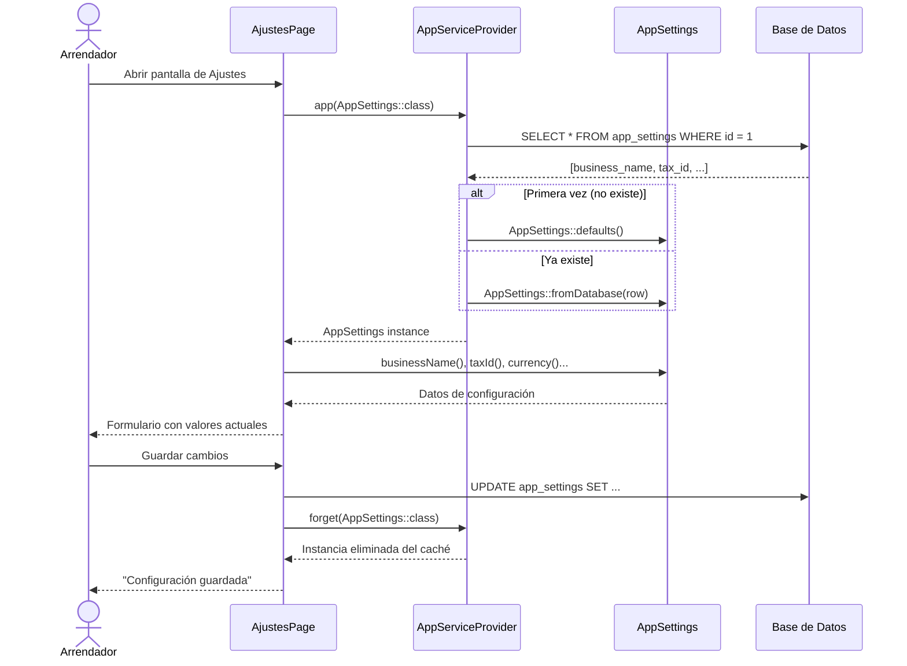
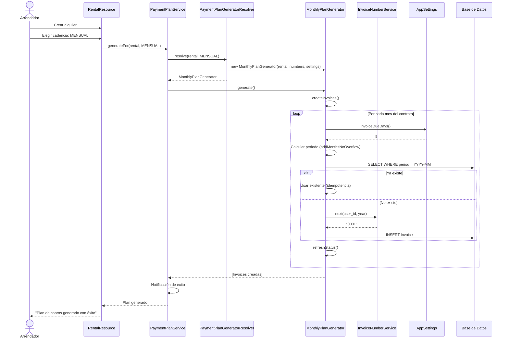
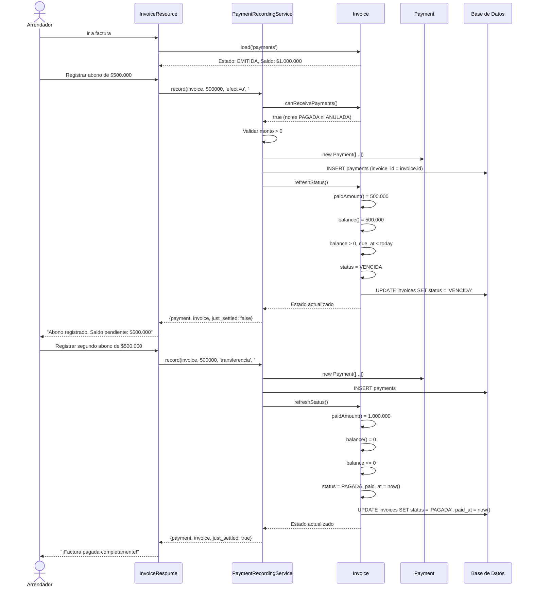
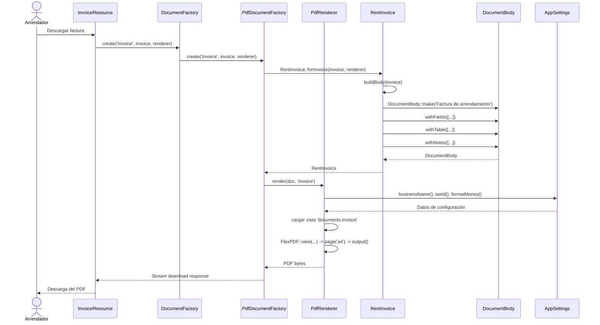
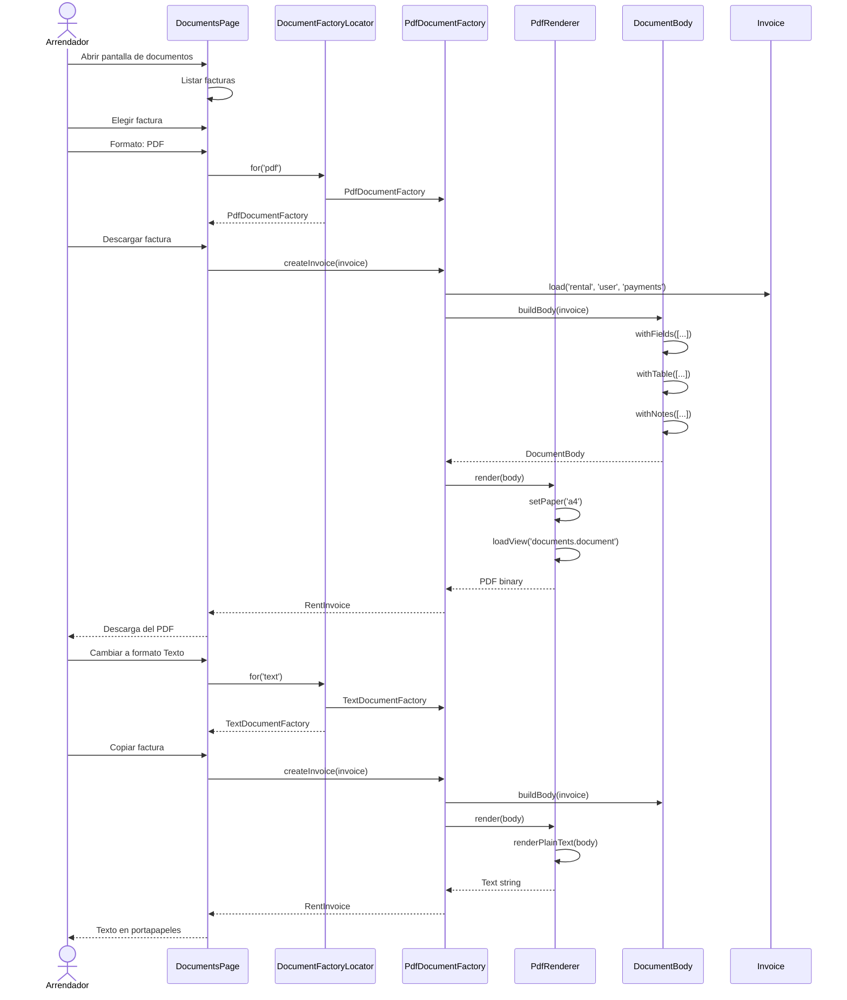
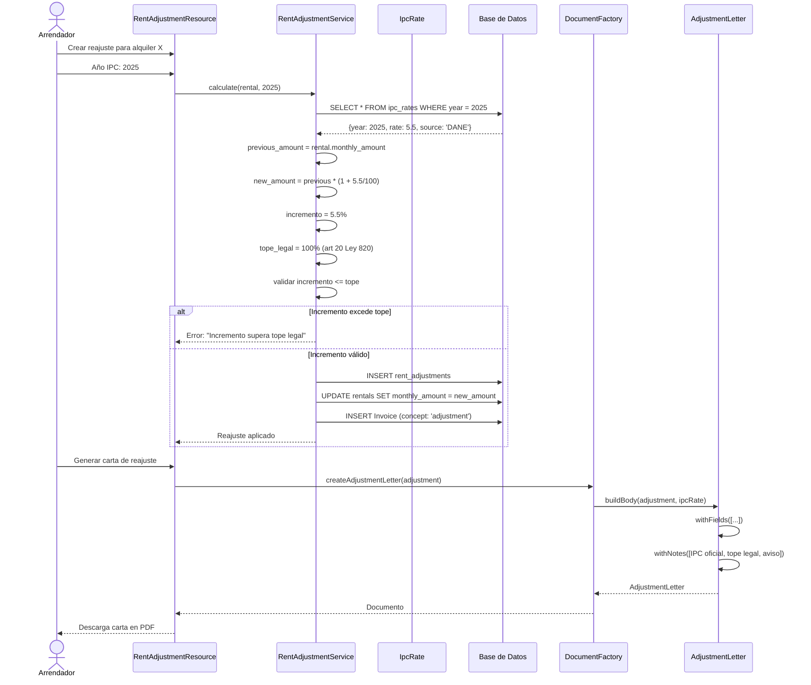
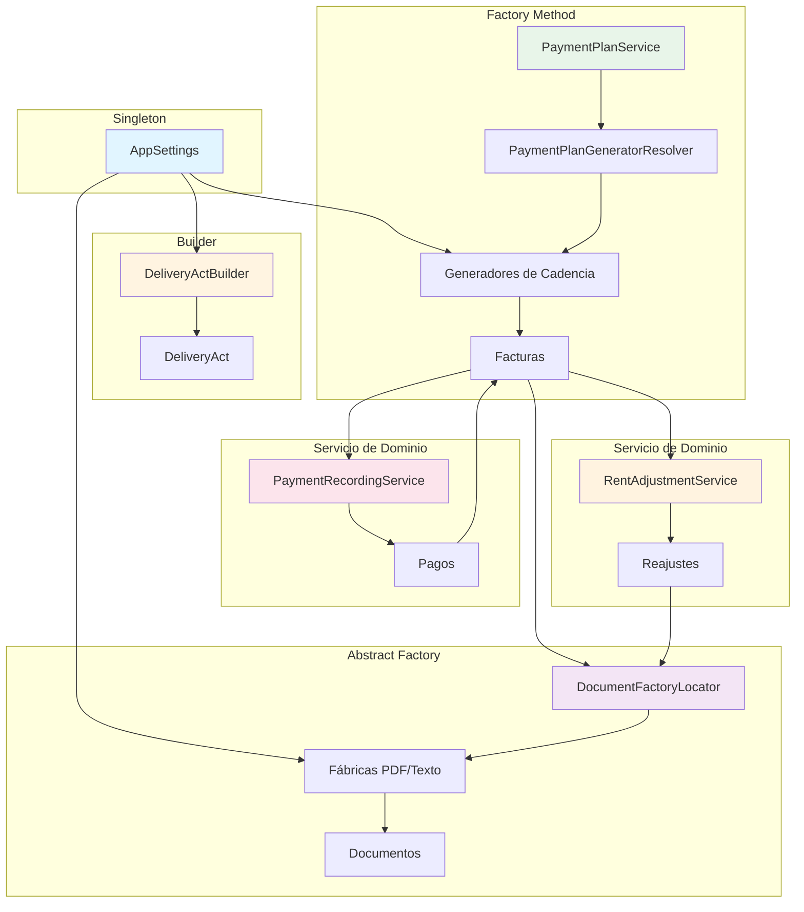

# Documentación de Flujos - Prometheus

Este documento describe **todos los flujos de negocio** del sistema, con diagramas de secuencia, explicación paso a paso, y puntos de decisión.

---

## Índice

1. [Flujo de Configuración (Singleton)](#1-flujo-de-configuración-singleton)
2. [Flujo de Acta de Entrega (Builder)](#2-flujo-de-acta-de-entrega-builder)
3. [Flujo de Generación de Plan de Cobros (Factory Method)](#3-flujo-de-generación-de-plan-de-cobros-factory-method)
4. [Flujo de Registro de Pagos](#4-flujo-de-registro-de-pagos)
5. [Flujo de Generación de Documentos (Abstract Factory)](#5-flujo-de-generación-de-documentos-abstract-factory)
6. [Flujo de Reajuste IPC](#6-flujo-de-reajuste-ipc)
7. [Diagrama de Relaciones entre Flujos](#7-diagrama-de-relaciones-entre-flujos)

---

## 1. Flujo de Configuración (Singleton)

**Patrón:** Singleton  
**Clave:** `AppSettings` (singleton real), `DeliveryActBuilder` (scoped)

### Propósito
Centralizar la configuración del negocio en una sola instancia compartida por toda la aplicación. Elimina la duplicación de datos y evita pasar parámetros en cascada.

### Actores
- **Arrendador:** Usuario que configura el sistema
- **Sistema:** Contenedor de Laravel + AppSettings

### Diagrama de Secuencia



### Paso a Paso

#### 1.1 Lectura de Configuración
1. Usuario abre la pantalla de Ajustes en Filament
2. La página solicita `AppSettings` al contenedor
3. El contenedor verifica si ya tiene una instancia en caché
4. Si no existe:
   - Consulta la tabla `app_settings` (id = 1)
   - Si no hay fila, usa `AppSettings::defaults()`
   - Si hay fila, usa `AppSettings::fromDatabase(row)`
5. Devuelve la misma instancia a cualquier petición dentro del ciclo de vida

#### 1.2 Modificación de Configuración
1. Usuario edita campos en el formulario
2. Al guardar, se actualiza la fila en `app_settings`
3. Se elimina la instancia del contenedor (`forget()`)
4. La siguiente petición leerá los nuevos valores desde DB

#### 1.3 Uso por Otros Componentes
- **Documentos PDF:** Reciben automáticamente nombre, NIT, dirección
- **Acta de entrega:** Usa `spaceCatalog` para validar inventario
- **Facturas:** Usa `invoiceDueDays` para calcular vencimiento
- **Formato de moneda:** Usa `formatMoney()` para consistencia

### Campos de AppSettings

| Campo | Tipo | Default | Descripción |
|-------|------|---------|-------------|
| `business_name` | string | config('app.name') | Nombre del negocio |
| `tax_id` | string | '' | NIT/RUT |
| `address` | string | '' | Dirección física |
| `currency` | string | 'COP' | Moneda para formatos |
| `logo_path` | string? | null | Ruta del logo |
| `email` | string? | null | Email de contacto |
| `phone` | string? | null | Teléfono |
| `invoice_due_days` | int | 5 | Días de vencimiento de factura |
| `legal_footer` | string? | null | Textos legales Ley 820 |
| `space_catalog` | array | [] | Catálogo de espacios ["cocina", "baño", ...] |

### Puntos de Decisión

- **¿Por qué Singleton y no Config?**
  - Config es estático y no se puede invalidar fácilmente
  - Singleton permite invalidar al guardar cambios
  - Permite inyección de dependencias en tests

- **¿Por qué DeliveryActBuilder es scoped?**
  - Builder acumula estado mientras construye
  - Si fuera singleton real, filtraría información entre peticiones
  - Scoped = una instancia por petición HTTP

---

## 2. Flujo de Acta de Entrega (Builder)

**Patrón:** Builder  
**Clave:** `DeliveryActBuilder`, `DeliveryAct`, `ActItem`

### Propósito
Construir un acta de entrega y recepción del inmueble paso a paso, con secciones opcionales y validación de inventario contra catálogo.

### Actores
- **Arrendador:** Usuario que crea el acta
- **Inquilino:** Parte que recibe el inmueble
- **Sistema:** Builder + Validaciones

### Diagrama de Secuencia

```mermaid
sequenceDiagram
    actor Arrendador
    participant Page as CreateDeliveryAct
    participant Builder as DeliveryActBuilder
    participant Settings as AppSettings
    participant Act as DeliveryAct
    participant DB as Base de Datos

    Arrendador->>Page: Crear acta para alquiler X
    Page->>Builder: forRental(rental, landlord, tenant)
    Builder->>Builder: Validar datos obligatorios
    Builder-->>Page: Builder (encadenable)

    Arrendador->>Page: Elegir tipo: entrega
    Page->>Builder: ofType('entrega')
    Builder-->>Page: Builder

    Arrendador->>Page: Fecha: 01/01/2026
    Page->>Builder: onDate(date, '10:00')
    Builder-->>Page: Builder

    opt Con lecturas de medidores
        Arrendador->>Page: Agregar lecturas agua/energía
        Page->>Builder: withMeterReadings([...])
        Builder-->>Page: Builder
    end

    opt Con inventario
        Arrendador->>Page: Agregar refrigerador en cocina
        Page->>Builder: withInventory([
            {space: 'cocina', name: 'refrigerador', state: 'BUENO'}
        ])
        Builder->>Settings: spaceCatalog()
        Settings-->>Builder: ['cocina', 'baño', 'sala']
        Builder->>Builder: Validar 'cocina' está en catálogo
        Builder-->>Page: Builder
    end

    opt Con compromisos
        Arrendador->>Page: Agregar compromisos
        Page->>Builder: withCommitments(text)
        Builder-->>Page: Builder
    end

    opt Con firmas
        Arrendador->>Page: Subir firmas
        Page->>Builder: withSignatures(landlord, tenant)
        Builder-->>Page: Builder
    end

    Arrendador->>Page: Descargar acta
    Page->>Builder: build()
    Builder->>Builder: Validar obligatorios
    Builder->>Act: new DeliveryAct(sections)
    Builder->>DB: INSERT delivery_acts
    Builder->>DB: INSERT act_items (si hay inventario)
    Act-->>Builder: DeliveryAct con items
    Builder-->>Page: DeliveryAct
    Page->>Page: Generar PDF
    Page-->>Arrendador: Descarga del acta
```

### Paso a Paso

#### 2.1 Inicialización
1. Usuario entra al alquiler y pulsa "Crear acta"
2. Se inyecta `DeliveryActBuilder` (scoped, una por petición)
3. Se llama `forRental()` con datos obligatorios:
   - `rental_id`: FK al alquiler
   - `landlord_name`: Nombre del arrendador
   - `tenant_name`: Nombre del inquilino

#### 2.2 Adición de Secciones (Métodos `with...`)
Cada método devuelve `$this` para permitir encadenamiento:

- **`ofType(string $type)`**: Tipo de acta (entrega/recepción)
- **`onDate(DateTime $date, ?string $time)`**: Fecha y hora programada
- **`withParties(array $documents)`**: Documentos de identidad
- **`withMeterReadings(array $readings)`**: Lecturas de agua/energía/gas
- **`withInventory(array $items)`**: Inventario por espacio
- **`withCommitments(?string $text, ?string $obs)`**: Compromisos y observaciones
- **`withSignatures(?string $landlord, ?string $tenant)`**: Rutas de firmas

#### 2.3 Validación de Inventario
1. Cada item del inventario tiene:
   - `space`: Espacio (cocina, baño, etc.)
   - `name`: Nombre del elemento
   - `state`: Estado (NUEVO, BUENO, REPARABLE, POR_REEMPLAZAR, DESTRUIDO)
   - `note`: Observación opcional
   - `photo_path`: Foto opcional

2. Builder valida que el `space` esté en `spaceCatalog` de AppSettings
3. Si no está, lanza `RuntimeException`

#### 2.4 Construcción Final
1. `build()` valida que los obligatorios estén presentes:
   - `rental_id`
   - `landlord_name`
   - `tenant_name`
   - `occurred_at`

2. Crea `DeliveryAct` con las secciones registradas
3. Si se solicitó inventario, crea `ActItem` asociados
4. Devuelve el acta con relaciones cargadas

### Estados de ActItem

| Estado | Descripción |
|--------|-------------|
| `NUEVO` | Elemento nuevo, sin uso previo |
| `BUENO` | Estado conservado, sin daños |
| `REPARABLE` | Daño menor, reparable |
| `POR_REEMPLAZAR` | Daño grave, necesita reemplazo |
| `DESTRUIDO` | No sirve, debe desecharse |

### Campos de DeliveryAct

| Campo | Tipo | Obligatorio | Descripción |
|-------|------|-------------|-------------|
| `rental_id` | FK | ✅ | Alquiler asociado |
| `type` | string | ❌ (default 'entrega') | Tipo de acta |
| `occurred_at` | date | ✅ | Fecha de la visita |
| `scheduled_at` | datetime | ❌ | Fecha y hora programada |
| `landlord_name` | string | ✅ | Nombre del arrendador |
| `tenant_name` | string | ✅ | Nombre del inquilino |
| `landlord_document` | string? | ❌ | Documento arrendador |
| `tenant_document` | string? | ❌ | Documento inquilino |
| `water_reading` | string? | ❌ | Lectura agua |
| `energy_reading` | string? | ❌ | Lectura energía |
| `gas_reading` | string? | ❌ | Lectura gas |
| `commitments` | string? | ❌ | Compromisos |
| `observations` | string? | ❌ | Observaciones |
| `landlord_signature_path` | string? | ❌ | Firma arrendador |
| `tenant_signature_path` | string? | ❌ | Firma inquilino |
| `signed_at` | datetime? | ❌ | Fecha de firma |

### Puntos de Decisión

- **¿Por qué validar espacio contra catálogo?**
  - Evita errores de tipeo ("cocina" vs "Cocina")
  - Agrupa inventario por espacios de forma consistente
  - Permite reportes por espacio ("¿qué había en el baño?")

- **¿Por qué las secciones son opcionales?**
  - En una entrega real pueden quedar varias vacías
  - Si fueran obligatorias, el formulario sería tedioso
  - Builder permite omitir sin pasar `null` en 20 parámetros

---

## 3. Flujo de Generación de Plan de Cobros (Factory Method)

**Patrón:** Factory Method  
**Clave:** `PaymentPlanGenerator` (abstract), `MonthlyPlanGenerator`, `QuincenalPlanGenerator`, `AdvancePlanGenerator`

### Propósito
Generar facturas automáticamente según la cadencia de cobro elegida para cada alquiler.

### Actores
- **Arrendador:** Usuario que configura el alquiler
- **Sistema:** PaymentPlanService + Generadores

### Diagrama de Secuencia



### Paso a Paso

#### 3.1 Selección de Cadencia
1. Usuario crea alquiler en Filament
2. Elige cadencia en el formulario:
   - `MENSUAL`: Una factura por mes
   - `QUINCENAL`: Dos facturas por mes (días 1 y 15)
   - `ANTICIPO`: Pago grande al inicio + saldos mensuales

3. El campo `billing_cadence` se guarda en la tabla `rentals`

#### 3.2 Resolución del Generador
1. `PaymentPlanService.generateFor()` recibe el alquiler y la cadencia
2. Llama a `PaymentPlanGeneratorResolver.resolve()`
3. El resolver usa `match` para devolver el generador correcto:
   ```php
   match ($cadence) {
       BillingCadence::MENSUAL => new MonthlyPlanGenerator(...),
       BillingCadence::QUINCENAL => new QuincenalPlanGenerator(...),
       BillingCadence::ANTICIPO => new AdvancePlanGenerator(...),
   }
   ```

#### 3.3 Generación de Facturas (Ejemplo Mensual)
1. `MonthlyPlanGenerator.createInvoices()` itera por cada mes del contrato
2. Para cada mes:
   - Calcula el periodo usando `addMonthsNoOverflow($month)`
   - El periodo es `YYYY-MM` (mes cobrado, no mes emitido)
   - Verifica si ya existe una factura con ese periodo (idempotencia)
   - Si no existe:
     - Obtiene el siguiente número consecutivo (por user_id, year)
     - Crea la factura con:
       - `number`: Consecutivo
       - `concept`: 'rent'
       - `amount`: `monthly_amount` del alquiler
       - `period`: YYYY-MM
       - `issued_at`: Primer día del periodo
       - `due_at`: `issued_at` + `invoice_due_days`
       - `status`: EMITIDA
   - Llama `refreshStatus()` para marcar como VENCIDA si corresponde

#### 3.4 Idempotencia
- Regenerar el plan no duplica facturas
- La verificación es: `WHERE rental_id = ? AND period = ?`
- Solo crea facturas que faltan

### Cadencias Detalladas

#### Mensual
- 1 factura por mes de contrato
- Día de emisión: 1 de cada mes
- Día de vencimiento: configurable (default 5 días)

#### Quincenal
- 2 facturas por mes
- Día 1: Canon (50% del monto mensual)
- Día 15: Servicios (50% del monto mensual)
- Cada una tiene su propio vencimiento

#### Anticipo
- 1 factura grande al inicio del contrato (ej: 3 meses)
- Facturas mensuales de saldo por el resto
- Útil para inquilinos que pagan por adelantado

### Campos de BillingCadence

| Valor | Descripción |
|-------|-------------|
| `MENSUAL` | Cobro mensual único |
| `QUINCENAL` | Cobro quincenal (canon + servicios) |
| `ANTICIPO` | Anticipo inicial + saldos |

### Puntos de Decisión

- **¿Por qué addMonthsNoOverflow?**
  - `addMonths()` normal: 31-ene + 1 mes = 3-mar (salta febrero)
  - `addMonthsNoOverflow()`: 31-ene + 1 mes = 28-feb
  - Sin esto, dos periodos caerían en el mismo YYYY-MM

- **¿Por qué el periodo es aparte?**
  - Una factura de marzo puede emitirse en febrero
  - El periodo es el mes que se cobra, no el mes del documento
  - Permite facturas anticipadas sin confusión

---

## 4. Flujo de Registro de Pagos

**Patrón:** Sin patrón específico (servicio de dominio)  
**Clave:** `PaymentRecordingService`, `Invoice`, `Payment`

### Propósito
Registrar abonos contra una factura y actualizar automáticamente el estado de la factura.

### Actores
- **Arrendador:** Usuario que registra pagos
- **Sistema:** PaymentRecordingService + Invoice

### Diagrama de Secuencia



### Paso a Paso

#### 4.1 Validaciones Previas
1. Usuario selecciona una factura
2. Verifica `canReceivePayments()`:
   - Debe ser diferente de `PAGADA`
   - Debe ser diferente de `ANULADA`
3. Si no puede recibir pagos, lanza `DomainException`

#### 4.2 Creación del Pago
1. Valida que el monto sea > 0
2. Crea `Payment` con:
   - `amount`: Monto pagado
   - `method`: Método de pago (efectivo/transferencia/nequi/otro)
   - `reference`: Referencia del pago
   - `date`: Fecha del pago (default hoy)
   - `invoice_id`: FK a la factura
   - `rental_id`: FK al alquiler
   - `user_id`: FK al usuario

#### 4.3 Recálculo del Estado de Factura
1. `Invoice.refreshStatus()` calcula:
   - `paidAmount()`: Suma de todos los pagos asociados
   - `balance()`: `amount - paidAmount`

2. Regla de estado:
   ```php
   if (balance <= 0) {
       status = PAGADA
       paid_at = now()
   } else if (due_at < today) {
       status = VENCIDA
       paid_at = null
   } else {
       status = EMITIDA
       paid_at = null
   }
   ```

3. Guarda los cambios en DB

#### 4.4 Respuesta al Usuario
1. Devuelve:
   - `payment`: El pago creado
   - `invoice`: La factura actualizada
   - `just_settled`: `true` si acabó de quedar pagada

2. Si `just_settled == true`, muestra notificación especial

### Estados de Invoice

| Estado | Condición | Descripción |
|--------|-----------|-------------|
| `EMITIDA` | `balance > 0` y `due_at >= today` | Factura emitida, no vencida |
| `PAGADA` | `balance <= 0` | Totalmente pagada |
| `VENCIDA` | `balance > 0` y `due_at < today` | Vencida sin pago completo |
| `ANULADA` | Manual | Anulada por el arrendador |

### Campos de Payment

| Campo | Tipo | Descripción |
|-------|------|-------------|
| `invoice_id` | FK | Factura asociada (reemplaza 4 booleanos) |
| `amount` | float | Monto pagado |
| `method` | string | Método de pago |
| `reference` | string? | Referencia del pago |
| `date` | date | Fecha del pago |
| `rental_id` | FK | Alquiler |
| `user_id` | FK | Usuario |

### Puntos de Decisión

- **¿Por qué eliminar los 4 booleanos?**
  - Antes: `water_paid`, `energy_paid`, `gas_paid`, `rent_paid`
  - Problema: No tenían monto asociado, imposible reconstituir
  - Solución: Referencia a factura, la factura tiene el concepto

- **¿Por qué el estado se deriva y no se escribe?**
  - Evita inconsistencias (pagado pero balance > 0)
  - Unica fuente de verdad: suma de pagos
  - Si se añade un pago, el estado se actualiza solo

---

## 5. Flujo de Generación de Documentos (Abstract Factory)

**Patrón:** Abstract Factory  
**Clave:** `DocumentFactory`, `PdfDocumentFactory`, `TextDocumentFactory`, `DocumentBody`, `DocumentRenderer`

### Propósito
Generar documentos (PDF y texto) de forma uniforme para diferentes tipos de documentos: facturas, comprobantes de pago, cartas de reajuste IPC y estados de cuenta mensuales. Este patrón permite extender el sistema con nuevos tipos de documentos o formatos de salida sin modificar el código existente.

### Actores
- **Arrendador:** Usuario que solicita documentos
- **Sistema:** DocumentFactory + Renderers (FlexPDF para PDF)

### Diagrama de Secuencia



### Paso a Paso

#### 5.1 Creación del Documento
1. Usuario selecciona una acción en Filament (ej: "Descargar factura")
2. `DocumentAction` llama a `DocumentFactory.create()`
3. La factory resuelve el tipo de documento:
   - `invoice` → `RentInvoice`
   - `receipt` → `PaymentReceipt`
   - `adjustment` → `AdjustmentLetter`
   - `statement` → `MonthlyStatement`

#### 5.2 Construcción del Body
Cada documento construye su `DocumentBody` con:
- **withFields()**: Campos clave-valor (número, concepto, monto, etc.)
- **withTable()**: Tablas de datos (pagos parciales, reajustes, etc.)
- **withNotes()**: Notas informativas o legales
- **withWarnings()**: Alertas (exceso de tope legal, etc.)
- **withFooter()**: Pie de página del documento

#### 5.3 Renderizado con FlexPDF
1. `PdfRenderer` selecciona la vista Blade según el tipo:
   - `RentInvoice` → `documents.invoice`
   - `PaymentReceipt` → `documents.receipt`
   - `AdjustmentLetter` → `documents.adjustment-letter`
   - `MonthlyStatement` → `documents.monthly-statement`

2. La vista incluye:
   - CSS inline para FlexPDF (soporta CSS moderno)
   - Datos del documento (`$document->invoice()`, etc.)
   - Configuración de la empresa (`$settings->businessName()`, etc.)
   - Información detallada del cliente, propiedad, contrato, facturación

3. FlexPDF genera el PDF usando:
   - `page('a4')`: Tamaño de página
   - `output()`: Genera bytes del PDF
   - `streamDownload()`: Laravel retorna la descarga al navegador

#### 5.4 Información en Facturas
Las facturas incluyen información completa tipo servicios públicos:
- **Header:** Nombre empresa, NIT, dirección, contacto
- **Invoice meta:** Número, fecha emisión, fecha vencimiento
- **Customer Information:** Nombre, documento, teléfono, email
- **Contract Information:** Número contrato, fecha inicio, fecha fin, duración
- **Service Location:** Nombre propiedad, dirección, unidad, ocupantes
- **Billing Information:** Periodo, cadencia de cobro, tipo de servicio, tarifa mensual
- **Invoice Details:** Tabla con descripción, periodo, tarifa, monto
- **Totals:** Subtotal, impuestos, total
- **Status Section:** Estado con color (emitido/pagado/vencido/anulado), monto factura, monto pagado, saldo pendiente, fecha vencimiento
- **Payment History:** Tabla de pagos parciales (si aplica)
- **Notes:** Notas legales y observaciones

#### 5.5 Información en Comprobantes
Los comprobantes de pago incluyen:
- **Header:** Igual que factura
- **Payment Status:** Sección destacada con fondo verde, estado "PAID"
- **Payment Details:** Número factura, fecha pago, monto factura, monto pagado
- **Payer Information:** Cliente, documento, propiedad, contrato, dirección
- **Payment Details:** Tabla con descripción, periodo, monto pagado
- **Payment Breakdown:** Tabla de pagos (fecha, abono, método, referencia)
- **Notes:** Notas del comprobante

### Tipos de Documentos

| Tipo | Clase | Vista | Descripción |
|------|-------|-------|-------------|
| Factura | `RentInvoice` | `documents.invoice` | Documento de cobro para facturas emitidas |
| Comprobante | `PaymentReceipt` | `documents.receipt` | Recibo de pago para facturas pagadas |
| Carta Reajuste | `AdjustmentLetter` | `documents.adjustment-letter` | Notificación de reajuste IPC (Ley 820) |
| Estado Cuenta | `MonthlyStatement` | `documents.monthly-statement` | Resumen de facturas de un periodo |

### Características de FlexPDF
- Soporta CSS moderno (flexbox, grid, colores)
- Usa `@page` para configurar tamaño de página y márgenes
- Configuración en `config/flexpdf.php`
- CSS inline en plantillas Blade para mejor control
- No depende de Vite/Filament CSS del navegador

### Campos de DocumentBody

| Método | Descripción |
|--------|-------------|
| `make(string $title)` | Crea body con título |
| `withFields(array $fields)` | Agrega campos clave-valor |
| `withTable(array $headers, array $rows)` | Agrega tabla |
| `withNotes(string ...$notes)` | Agrega notas |
| `withWarnings(string ...$warnings)` | Agrega alertas |
| `withFooter(string $text)` | Agrega pie de página |
| `setDocument(AbstractDocument $doc)` | Asocia documento |

### Puntos de Decisión

- **¿Por qué Abstract Factory?**
  - Permite agregar nuevos tipos de documentos sin modificar código existente
  - Permite agregar nuevos formatos (ej: HTML, Excel) manteniendo la misma interfaz
  - Separa la lógica de construcción del formato de renderizado

- **¿Por qué FlexPDF en lugar de DOMPDF?**
  - DOMPDF tiene soporte CSS limitado (no soporta flexbox/grid modernos)
  - FlexPDF soporta CSS moderno y `@page`
  - FlexPDF tiene mejor integración con Laravel

- **¿Por qué CSS inline en plantillas?**
  - FlexPDF no consume automáticamente Vite/Filament CSS del navegador
  - CSS inline asegura que los estilos se apliquen en el PDF
  - Mayor control sobre el diseño específico de documentos
Generar documentos (factura, comprobante, estado de cuenta, carta de reajuste) en dos formatos: PDF y texto plano.

### Actores
- **Arrendador:** Usuario que solicita documento
- **Sistema:** DocumentFactoryLocator + Fábricas + Renderers

### Diagrama de Secuencia



### Paso a Paso

#### 5.1 Selección de Formato
1. Usuario abre pantalla de documentos
2. Elige formato: PDF o Texto
3. `DocumentFactoryLocator.for(format)` devuelve la fábrica:
   - `'pdf'` → `PdfDocumentFactory`
   - `'text'` → `TextDocumentFactory`

#### 5.2 Creación del Documento
Cada fábrica tiene 4 métodos:
- `createInvoice(Invoice $invoice)` → `RentInvoice`
- `createReceipt(Payment $payment)` → `PaymentReceipt` (solo si factura PAGADA)
- `createStatement(AccountStatement $statement)` → `MonthlyStatement`
- `createAdjustmentLetter(RentAdjustment $adj)` → `AdjustmentLetter`

#### 5.3 Construcción del Cuerpo (DocumentBody)
`DocumentBody` es un Value Object que contiene:
- `title`: Título del documento
- `fields`: Array de campos clave-valor
- `headers`: Encabezados de tabla
- `rows`: Filas de tabla
- `warnings`: Avisos importantes
- `notes`: Notas de pie
- `footer`: Texto de pie de página

Métodos de construcción:
- `withFields(array $fields)`: Agrega campos
- `withTable(array $headers, array $rows)`: Agrega tabla
- `withNotes(string $note)`: Agrega notas
- `withFooter(string $footer)`: Agrega pie

#### 5.4 Renderizado
Cada renderer implementa `DocumentRenderer`:

**PdfRenderer:**
- Usa DomPDF
- Carga view `documents.document`
- Configura papel A4
- Devuelve binary PDF

**PlainTextRenderer:**
- Genera texto con alineación de columnas
- Usa ancho máximo de 46 caracteres por columna
- Devuelve string

#### 5.5 Restricción del Comprobante
`PaymentReceipt` solo se crea si la factura está PAGADA:
```php
if ($invoice->status !== InvoiceStatus::PAGADA) {
    throw new DomainException(
        'El comprobante solo existe para facturas pagadas.'
    );
}
```

### Productos del Abstract Factory

| Producto | Restricción | Uso |
|----------|-------------|-----|
| `RentInvoice` | Ninguna | Para cobrar |
| `PaymentReceipt` | Solo si factura PAGADA | Comprobante contable |
| `MonthlyStatement` | - | Estado de cuenta mensual |
| `AdjustmentLetter` | - | Carta de reajuste IPC |

### Formatos Soportados

| Formato | Renderer | Entrega |
|---------|----------|---------|
| PDF | PdfRenderer | Descarga |
| Texto | PlainTextRenderer | Copiar al portapapeles |

### Puntos de Decisión

- **¿Por qué Abstract Factory y no un switch?**
  - Cada formato es una familia completa (plantilla + generador + acción)
  - Imposible mezclar: PDF nunca aparece con botón de copiar
  - Agregar formato = nueva fábrica, sin tocar productos

- **¿Por qué el comprobante tiene restricción?**
  - Regla de negocio: solo se puede acreditar lo pagado
  - Evita fraude: comprobante de factura sin pagar
  - La restricción está en el dominio, no solo en la UI

---

## 6. Flujo de Reajuste IPC

**Patrón:** Abstract Factory (usa AdjustmentLetter)  
**Clave:** `RentAdjustmentService`, `RentAdjustment`, `IpcRate`, `AdjustmentLetter`

### Propósito
Aplicar reajuste por IPC anual con tope legal del artículo 20 de la Ley 820 de 2003.

### Actores
- **Arrendador:** Usuario que aplica reajuste
- **Sistema:** RentAdjustmentService + IPC DANE

### Diagrama de Secuencia



### Paso a Paso

#### 6.1 Cálculo del Reajuste
1. Usuario selecciona alquiler y año de IPC
2. `RentAdjustmentService.calculate()`:
   - Busca `IpcRate` por año (fuente DANE)
   - Calcula incremento: `previous_amount * (1 + ipc_rate/100)`
   - Valida contra tope legal (100% según art 20 Ley 820)

#### 6.2 Aplicación del Reajuste
1. Crea `RentAdjustment` con:
   - `rental_id`: Alquiler
   - `ipc_rate_id`: FK a IpcRate
   - `previous_amount`: Monto anterior
   - `new_amount`: Monto nuevo
   - `applied_at`: Fecha de aplicación

2. Actualiza `rentals.monthly_amount` con el nuevo valor

3. Crea una `Invoice` de concepto `adjustment` para el primer mes

#### 6.3 Generación de Carta
1. `AdjustmentLetter` usa Abstract Factory
2. Incluye en el cuerpo:
   - IPC oficial del año con fuente
   - Incremento calculado
   - Tope legal (art 20 Ley 820)
   - Aviso si el incremento supera el tope

### Campos de RentAdjustment

| Campo | Tipo | Descripción |
|-------|------|-------------|
| `rental_id` | FK | Alquiler |
| `ipc_rate_id` | FK | Tasa IPC |
| `previous_amount` | float | Monto anterior |
| `new_amount` | float | Monto nuevo |
| `applied_at` | date | Fecha aplicación |

### Campos de IpcRate

| Campo | Tipo | Descripción |
|-------|------|-------------|
| `year` | int | Año |
| `rate` | float | Porcentaje IPC |
| `source` | string | Fuente (DANE) |

### Puntos de Decisión

- **¿Por qué validar contra tope legal?**
  - Artículo 20 Ley 820: incremento máximo 100%
  - Si se supera, solo opera con acuerdo escrito
  - El arrendatario debe estar informado

- **¿Por qué guardar la fuente del IPC?**
  - Transparencia: el inquilino puede verificar
  - Respaldo legal: datos oficiales DANE

---

## 7. Diagrama de Relaciones entre Flujos



### Flujo Completo de Negocio

```
1. Configuración (Singleton)
   ↓
   Arrendador configura negocio (nombre, NIT, catálogo de espacios)

2. Creación de Alquiler
   ↓
   Arrendador crea alquiler y elige cadencia
   ↓
   Factory Method genera facturas según cadencia
   ↓
   Facturas se crean con estado EMITIDA

3. Registro de Pagos
   ↓
   Arrendador registra abonos contra factura
   ↓
   Estado de factura se recalcula automáticamente
   ↓
   Si balance <= 0 → PAGADA

4. Generación de Documentos
   ↓
   Con factura PAGADA, se puede generar comprobante
   ↓
   Abstract Factory produce documento en PDF o texto

5. Acta de Entrega (en cualquier momento)
   ↓
   Builder construye acta paso a paso
   ↓
   Usa configuración del Singleton

6. Reajuste IPC (anual)
   ↓
   Servicio calcula incremento con IPC DANE
   ↓
   Valida tope legal
   ↓
   Crea reajuste y carta de notificación
```

---

## Resumen de Patrones por Flujo

| Flujo | Patrón | Clases Principales |
|-------|--------|-------------------|
| Configuración | Singleton | AppSettings, DeliveryActBuilder (scoped) |
| Acta de Entrega | Builder | DeliveryActBuilder, DeliveryAct, ActItem |
| Plan de Cobros | Factory Method | PaymentPlanGenerator, Monthly/Quincenal/Advance |
| Registro de Pagos | Servicio de Dominio | PaymentRecordingService, Invoice, Payment |
| Documentos | Abstract Factory | DocumentFactory, Pdf/TextFactory, DocumentBody |
| Reajuste IPC | Servicio de Dominio | RentAdjustmentService, RentAdjustment, IpcRate |

---

## Notas de Diseño

### Separación de Responsabilidades
- **Singleton:** Configuración global, inmutable
- **Builder:** Construcción compleja paso a paso
- **Factory Method:** Creación de variantes (cadencias)
- **Abstract Factory:** Familias de productos (formatos)
- **Servicios de Dominio:** Lógica de negocio sin patrón específico

### Inmutabilidad
- `AppSettings`: Inmutable, se descarta al guardar
- `DocumentBody`: Value object, inmutable
- `Invoice`: Estado derivado, no se escribe manualmente

### Idempotencia
- Generación de plan de cobros: no duplica facturas
- Registro de pagos: múltiples abonos permitidos
- Reajuste IPC: uno por año por alquiler

### Validaciones
- En el dominio, no solo en la UI
- Excepciones descriptivas
- Validación de espacios contra catálogo
- Restricción de comprobante a facturas pagadas
