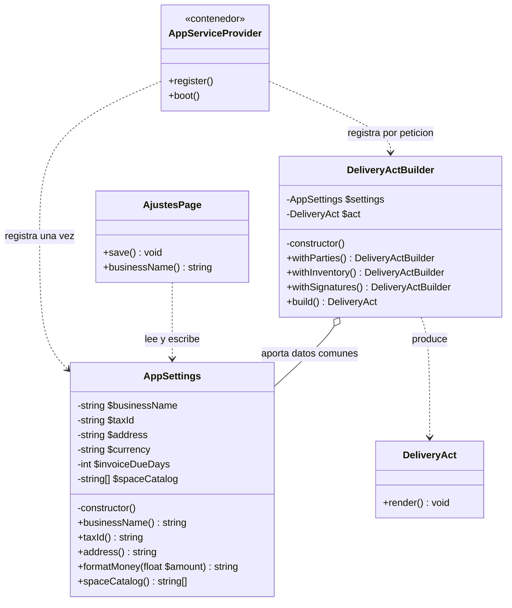
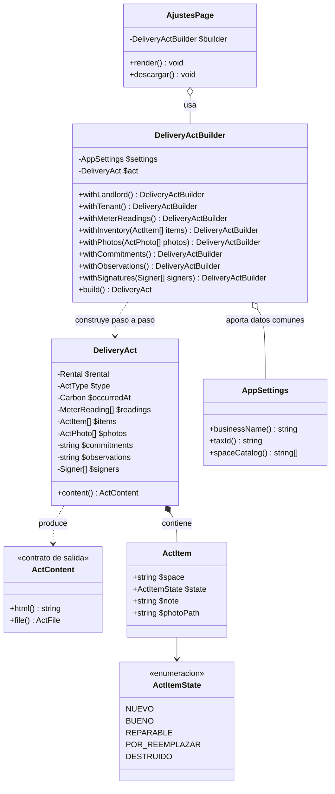
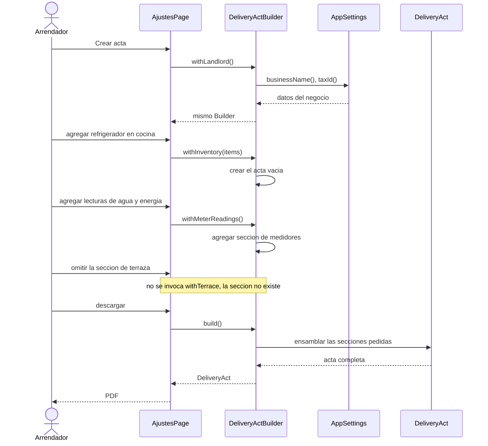
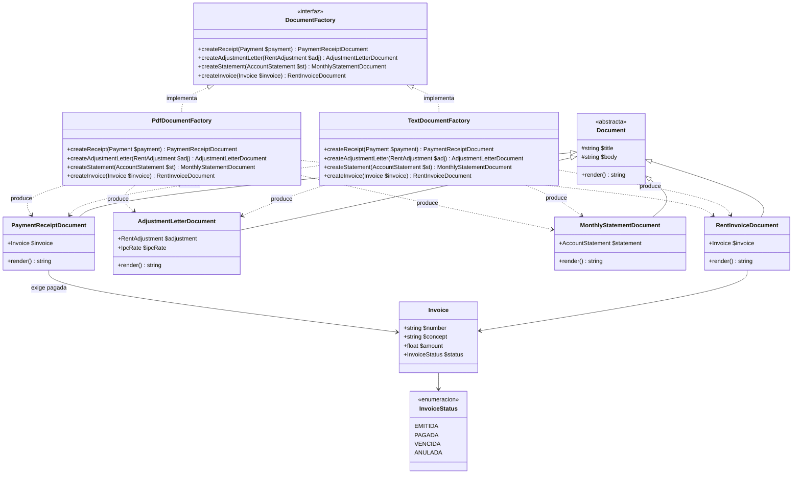
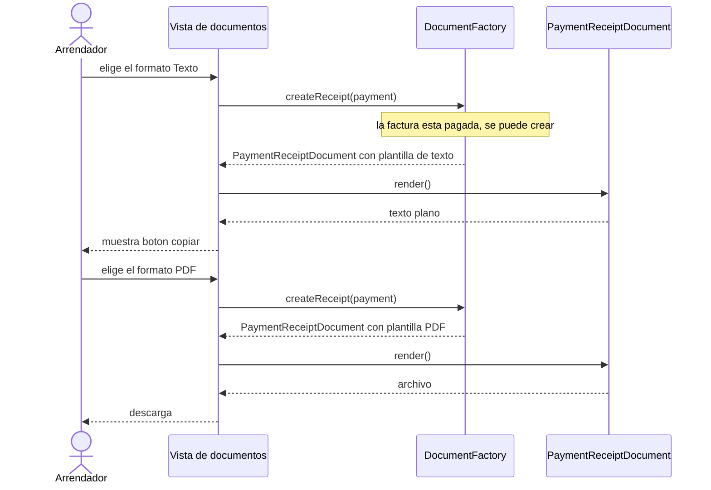
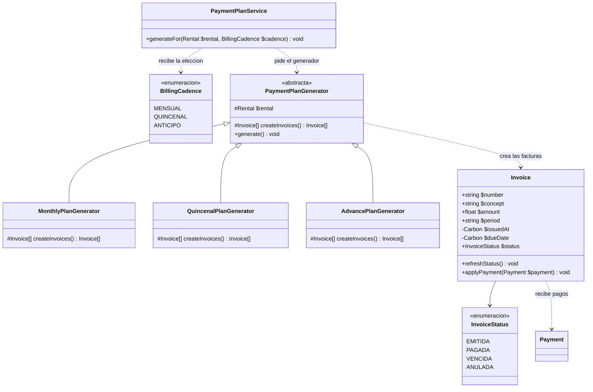
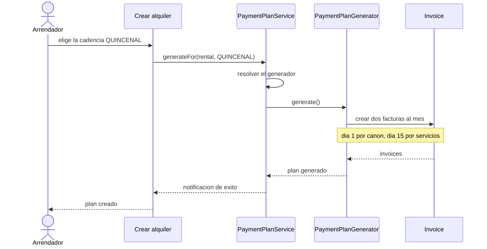

# Diagramas UML de los cuatro patrones

Este documento acompaña a `PLAN-PATRONES.md`. Ahí se explica **por qué** se implementa cada patrón; aquí se muestra **cómo queda la estructura de clases** de cada uno.

## Cómo ver los diagramas

Los diagramas están escritos en Mermaid, así que se renderizan solos en GitHub, en VS Code con la extensión Mermaid y en la vista previa de Markdown del navegador. Si prefieres verlos como imagen, cualquier visor de Mermaid los convierte a SVG o PNG.

## Alcance de los diagramas

Cada diagrama incluye **solo las clases necesarias para que el patrón se entienda**. Se dejaron fuera, de forma deliberada:

- Las pantallas de Filament, salvo `AjustesPage`, que sí aparece porque es el cliente que usa el patrón.
- Los widgets del panel y las consultas duplicadas, porque no son parte de estos cuatro patrones.
- La capa de entrada HTTP, que no aporta nada a la lectura de los patrones.

## Resumen

| Patrón | Dónde se aplica | Diagrama |
| --- | --- | --- |
| Singleton | Configuración de la aplicación y el constructor del acta | Clases |
| Builder | Acta de entrega y recepción del inmueble | Clases y secuencia |
| Abstract Factory | Los cuatro documentos en PDF y en texto | Clases y secuencia |
| Factory Method | Cadencia de cobro de los alquileres | Clases y secuencia |

---

## 1. Singleton

**Qué resuelve.** Que exista una sola instancia de la configuración de la aplicación y una sola instancia del constructor del acta dentro de cada petición, en lugar de cuatro cachés estáticos que hoy son copias redundantes.

**Distinción importante.** `AppSettings` es un singleton real: es inmutable y vive una vez. `DeliveryActBuilder` se registra con alcance de petición, porque acumula secciones mientras construye y no debe arrastrar nada a la siguiente petición.

### Diagrama de clases



**Cómo se lee.**

- Las flechas punteadas hacia `AppSettings` y `DeliveryActBuilder` salen del contenedor, no de otra clase de negocio. Ahí es donde se decide el tiempo de vida de cada instancia.
- `AppSettings` tiene constructor privado. Nadie puede crear una segunda instancia desde fuera; hay que pasar por el contenedor.
- `DeliveryActBuilder` depende de `AppSettings` y por eso hereda automáticamente el nombre del negocio, el NIT y el catálogo de espacios. Por eso no hay que pasarle esos datos como parámetros.

---

## 2. Builder

**Qué resuelve.** El acta tiene más de quince secciones y casi todas son opcionales. El Builder es el único que sabe cuáles existen, en qué orden van y cuáles se pueden omitir.

### Diagrama de clases



**Cómo se lee.**

- Todos los métodos `with...` devuelven el propio Builder. Eso permite encadenarlos y es lo que hace que el orden de armado sea explícito en la pantalla.
- Las secciones obligatorias son las que no tienen método opcional: el Builder las coloca siempre en `build()`.
- `ActContent` separa el acta del formato en que se muestra. Gracias a ese contrato, el acta se puede imprimir en PDF hoy y mandar como texto mañana sin tocar el Builder.

### Diagrama de secuencia



**Lo que demuestra la secuencia.** El Builder no tiene un método para todo el documento. Arma lo que se le pide. Si una sección no se pide, no aparece en el acta. Esa es exactamente la diferencia frente a pasar veinte parámetros.

---

## 3. Abstract Factory

**Qué resuelve.** Los cuatro documentos existen en dos formatos: PDF y texto. Cada formato es una familia completa que trae su plantilla, su generador y su acción de entrega. Las familias no se pueden mezclar entre sí.

### Diagrama de clases



**Cómo se lee.**

- La interfaz `DocumentFactory` declara los cuatro métodos y no dice nada sobre el formato. Quien la consume no sabe si va a recibir un PDF o un texto.
- Las dos fábricas concretas implementan los mismos cuatro métodos. Cada una devuelve el mismo producto, pero con su plantilla y su forma de entrega.
- Ningún producto sabe de qué fábrica salió. Solo sabe renderizarse. Esa es la garantía de que un documento en PDF nunca aparecerá con el botón de copiar.
- `PaymentReceiptDocument` apunta a `Invoice` y solo se crea cuando la factura está pagada. La regla de negocio queda visible en el diagrama, no escondida en la pantalla.

### Diagrama de secuencia



**Lo que demuestra la secuencia.** El cliente pide el mismo documento dos veces y en los dos casos pide solo un formato. Nunca pide "texto con descarga", porque esa combinación no existe en ninguna familia.

---

## 4. Factory Method

**Qué resuelve.** Hoy la cadencia mensual está escrita dentro del servicio y no hay forma de cobrarla cada quince días ni con anticipo. El Factory Method deja que cada subclase conozca solo su propio ritmo.

### Diagrama de clases



**Cómo se lee.**

- El paso 3 del plan elimina los cuatro interruptores de servicios pagados y hace que el estado se deduzca de la factura. Por eso los generadores crean `Invoice` y no `Payment`. La relación entre `Invoice` y `Payment` es lo que permite que el comprobante se habilite cuando la factura queda pagada.
- `PaymentPlanService` recibe la elección del usuario y pide el generador. No contiene ningún cálculo de fechas.
- El método `createInvoices()` es el punto de decisión: cada subclase decide cuántos meses cubre y qué día vence, sin que nadie más se entere.

### Diagrama de secuencia



**Lo que demuestra la secuencia.** El servicio no sabe qué significa quincenal. Solo pide el generador que corresponde y ejecuta. Agregar la cadencia "semanal" sería agregar una clase, sin tocar el servicio ni las pantallas.

---

## Cómo se relacionan los cuatro patrones

No están aislados: el paso 1 los sostiene a todos.

```
AppSettings  (Singleton, una vez)
     |
     +---->  DeliveryActBuilder  (Singleton de peticion)
     |               |
     |               +---->  DeliveryAct
     |
     +---->  PdfDocumentFactory  (Abstract Factory)
     |               |
     +---->  TextDocumentFactory (Abstract Factory)
                     |
                     +---->  documentos que reciben Invoice

PaymentPlanService  ---->  PaymentPlanGenerator  (Factory Method)
                                  |
                                  +---->  genera Invoice
```

- Los dos **Singleton** están en la base y alimentan al **Builder** y a las dos fábricas. Por eso los documentos salen con el nombre del negocio, el NIT, la moneda y los textos legales correctos sin que nadie los pase como parámetro.
- El **Factory Method** produce las facturas. Las fábricas de documentos y el Builder se apoyan en esas facturas, no en pagos sueltos.

## Nota sobre el orden de lectura

Si solo quieres entender el flujo de negocio de punta a punta, el camino más corto es:

1. El arrendador crea un alquiler y elige la cadencia. **Factory Method** genera las facturas.
2. El arrendador emite la factura y registra pagos. La factura cambia de estado cuando queda pagada.
3. Con la factura pagada, la **Abstract Factory** produce el comprobante en PDF o en texto.
4. En cualquier momento, el **Builder** arma el acta de entrega usando la configuración del **Singleton**.