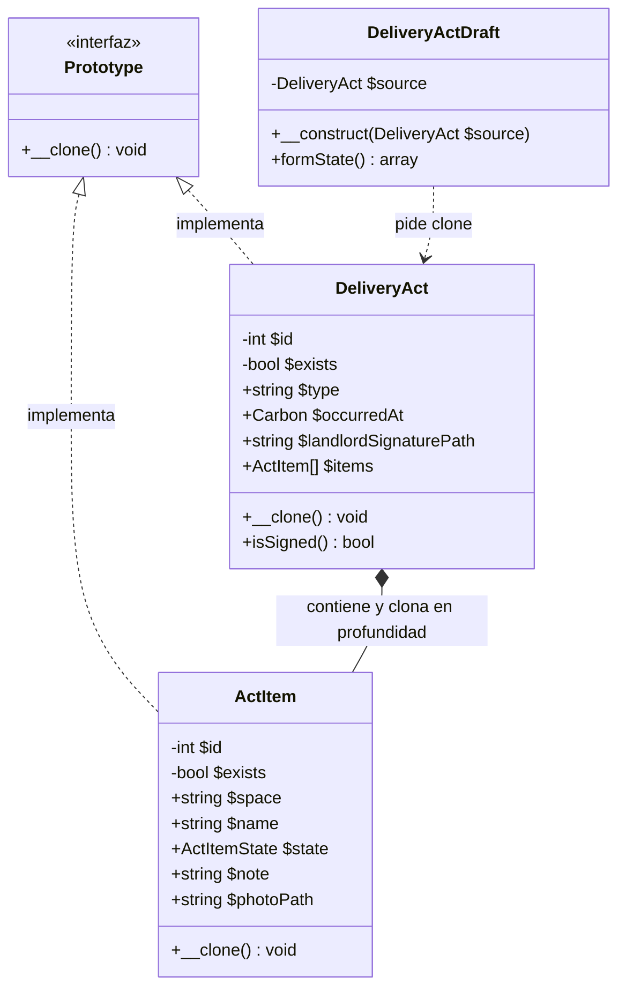
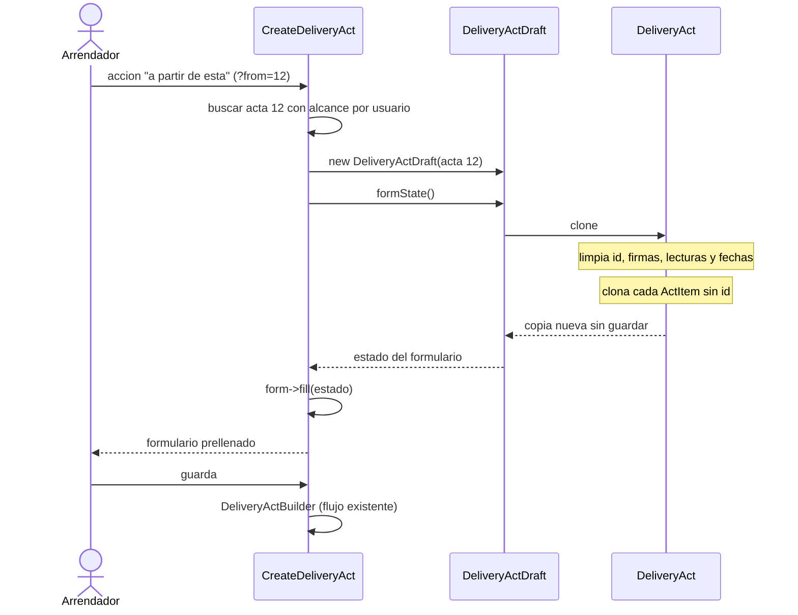

# Prototype: acta derivada de otra acta

Este documento explica el patrón **Prototype** y las clases concretas del proyecto que lo cumplen.

## Cómo ver los diagramas

Los diagramas están en Mermaid: se renderizan en GitHub, en VS Code con la extensión Mermaid y en la vista previa de Markdown del navegador.

## Qué resuelve

**El patrón.** Prototype especifica el tipo de objeto a partir de una instancia ya existente, y lo crea **copiándolo** en vez de construirlo desde cero. En GoF, quien necesita un objeto nuevo le pide al prototipo que se clone, sin pasar por un constructor de veinte parámetros.

**El caso de negocio.** Una acta de entrega tiene entre 30 y 60 filas de inventario (espacio, elemento, estado, nota, foto). Digitar ese inventario de nuevo para una visita posterior es tedioso y propenso a errores. La acción **"Crear acta a partir de esta"** copia la acta anterior y deja el formulario prellenado para que el arrendador solo ajuste lo que cambió.

**Por qué no la acción `ReplicateAction` de Filament.** Esa acción guarda la copia de inmediato, sin dejar revisar el inventario, y `DeliveryActResource` no tiene página de edición (un acta corregida es una acta nueva). El flujo correcto es **prellenar** el formulario y dejar que la persistencia la haga el `DeliveryActBuilder` de siempre.

## Roles de GoF y sus equivalentes en el proyecto

| Rol de GoF | Clase en el proyecto | Responsabilidad |
| --- | --- | --- |
| **Prototype** (interfaz) | `App\Contracts\Prototype` | Declara `__clone()`. No sabe qué contiene; solo garantiza que el objeto se puede copiar. |
| **ConcretePrototype** | `App\Models\DeliveryAct` | Implementa la copia **en profundidad**: limpia identidad y estado del evento, y clona su inventario. |
| **ConcretePrototype** (parte) | `App\Models\ActItem` | Implementa la copia de cada fila del inventario: conserva el contenido y descarta `id`, `exists` y las llaves foráneas. |
| **Client** | `App\Services\Acts\DeliveryActDraft` | Pide el clon al prototipo y lo traduce al estado del formulario. |
| *(no forma parte del patrón)* | `CreateDeliveryAct` y la acción de tabla | Solo inician el flujo y reciben el estado. |
| *(no aplica)* | Prototype Registry | GoF lo describe como opcional. Aquí no hay catálogo de actas reutilizables: cada acta se deriva de una concreta. |

### Diagrama de clases

### Diagrama de secuencia

**Lo que demuestra la secuencia.** Nadie escribe `new DeliveryAct()` ni redigita el inventario. El cliente pide una copia, la copia existe solo en memoria y quien finalmente persiste sigue siendo el Builder.

## Política de clonación

| Grupo | Qué hace la copia |
| --- | --- |
| **Se conserva** | `rental_id`, `type`, nombres y documentos de las partes, y **todo el inventario**: espacio, elemento, estado, nota y foto. |
| **Se limpia** | `id`/`exists` (es un registro nuevo), firmas y `signed_at` (pertenecen al evento anterior), lecturas de medidores, compromisos y observaciones, `scheduled_at`. |
| **Se redefine** | `occurred_at` pasa a ser la fecha de hoy: la visita es de ahora. |

**Por qué así.** Lo caro de rehacer es el inventario, y ese es exactamente lo que se conserva. Las lecturas, las firmas y los compromisos describen **un evento concreto**; copiarlos produciría un acta firmada con datos de otra visita.

**Copia profunda, no superficial.** `clone` en PHP copia referencias: si solo se clonara el `DeliveryAct`, la copia seguiría apuntando a la **misma** colección de `ActItem`. Por eso `DeliveryAct::__clone()` recorre y clona cada fila. Al final, modificar un ítem del borrador no toca a la acta original.

## Fuera del alcance de este documento

- El `DeliveryActBuilder`, que es quien arma y persiste el acta. El patrón no lo sustituye: solo produce el punto de partida.
- Las pantallas de Filament, salvo la que aparece en la secuencia como punto de entrada.
- El estado de las pruebas de esta zona del acta, que es anterior a este trabajo y no se modificó aquí.
