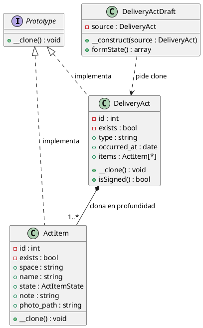

# Prototype en PlantUML y monólogo

Archivo de apoyo para pegar el diagrama en draw.io y para la explicación oral del patrón.

## Cómo pegarlo en draw.io

1. En draw.io: **Arrange > Insert > Advanced > PlantUML** (o el botón **+ > Advanced > PlantUML**).
2. Pegar el bloque de abajo tal cual, entre `@startuml` y `@enduml`.
3. **Preview** y luego **Insert**.

> draw.io trae una implementación **parcial** de PlantUML, así que el código usa solo el subconjunto básico: declaraciones `class`/`interface`, miembros con visibilidad (`+`/`-`) y flechas simples (`<|--`, `*--`, `..>`). Sin `skinparam`, `note` ni `package`, que es donde ese motor se complica.

## Diagrama de clases

### Qué quedó fuera del diagrama

Solo aparecen las clases necesarias para explicar el patrón. Quedan fuera, a propósito:

- **`CreateDeliveryAct`** y la acción **`derive`** de la tabla: inician el flujo (`?from=<id>`) y reciben el estado, pero no cumplen un rol de GoF. Un diagrama de secuencia las mostraría; un diagrama de clases del patrón, no.
- **`DeliveryActBuilder`**: sigue siendo quien arma y persiste el acta. El patrón no lo sustituye, solo le entrega el punto de partida.
- **Prototype Registry**: GoF lo describe como opcional y aquí no aplica: cada acta se deriva de una concreta, no de un catálogo reutilizable.

---

## Monólogo

El patrón **Prototype** resolvía un problema sencillo de enunciar: en este proyecto, crear un objeto nuevo equivalía a escribirlo entero otra vez. Prototype propone lo contrario: en vez de construir desde cero, se toma una instancia que ya existe y se **copia**. Quien necesita el objeto nuevo no arma uno, le pide al prototipo que se clone y trabaja sobre la copia. De ahí salen los tres actores clásicos del patrón: el prototipo que sabe copiarse, la interfaz que dice "cualquier objeto de este tipo se puede copiar" y el cliente que pide la copia y la usa.

Valía la pena implementarlo aquí por la forma en que se documenta una acta de entrega. Un acta lleva entre 30 y 60 filas de inventario —espacio, elemento, estado, nota, foto— y las visitas se repiten sobre los mismos inmuebles: la segunda entrega suele tener el mismo refrigerador en la misma cocina, con el mismo estado. Redigitar ese inventario para cada visita era lento y propenso a errores de tipeo, y era exactamente el tipo de trabajo que una máquina debería hacer por cuenta propia. Había además dos caminos que ya se habían descartado: la acción `ReplicateAction` de Filament guardaba la copia de inmediato, sin dejar que nadie revisara el inventario antes, y `DeliveryActResource` no tiene página de edición porque una acta corregida es una acta nueva, no una reescritura. La decisión fue prellenar el formulario de creación con una copia y dejar que la persistencia siguiera siendo del `DeliveryActBuilder` de siempre.

La primera pieza fue la interfaz **`App\Contracts\Prototype`**, que ocupaba el rol de *Prototype* en GoF. Su única responsabilidad era declarar `__clone(): void`: no decía nada de qué contenía el objeto, solo garantizaba que se podía copiar. Ese silencio era deliberado, porque el patrón trabaja sobre tipos y no sobre atributos concretos.

**`App\Models\DeliveryAct`** era el *ConcretePrototype* principal, y ahí estaba la parte difícil. `__clone()` hacía dos cosas. Primero limpiaba lo que describía el evento anterior: `id` y `exists` (porque era un registro nuevo), las firmas y `signed_at`, las lecturas de los medidores, los compromisos, las observaciones y `scheduled_at`; y redefinía `occurred_at` a hoy, porque la visita era de ahora. Segundo, y sobre todo, hacía la **copia en profundidad**: recorría la colección de `ActItem` y clonaba cada fila por separado. Sin eso, la copia seguiría apuntando a la misma colección que el acta original y modificar un ítem del borrador habría tocado al acta firmada.

**`App\Models\ActItem`** era el *ConcretePrototype* de la parte: cada fila del inventario también tenía que saber copiarse. Su `__clone()` conservaba el contenido —espacio, elemento, estado, nota y foto— y descartaba la identidad: `id`, `exists`, `delivery_act_id` y `space_id`. Lo del `space_id` tenía lógica propia: el Builder resolvía el espacio por nombre al guardar, así que la copia no necesitaba arrastrar la llave foránea, solo el texto.

**`App\Services\Acts\DeliveryActDraft`** ocupaba el rol de *Client*. Era quien necesitaba el objeto nuevo y, en vez de armar un `DeliveryAct` con veinte argumentos, le pedía `clone` al prototipo. Su método `formState()` traducía esa copia al estado exacto que esperaba el formulario del resource: los nombres de los campos tal cual, el inventario como lista de filas y todo lo que el clon había limpiado llegaba vacío, que es lo mismo que el Builder interpretaba como "sección ausente". El cliente nunca persistía nada; solo entregaba el punto de partida.

En el diagrama no aparecen ni `CreateDeliveryAct` ni la acción `derive` de la tabla: cumplían la función de punto de entrada —abrir `?from=<id>`, buscar el acta con el alcance por usuario y llamar a `form->fill()`— pero no eran roles de GoF. Tampoco aparecía el Prototype Registry, que GoF marca como opcional y que aquí no tenía sentido: cada acta se deriva de una concreta, no de un catálogo reutilizable. Y el `DeliveryActBuilder` seguía intacto, porque el patrón no lo sustituía: le entregaba el acta ya dibujado y dejaba la escritura en manos de quien siempre la había hecho.

Lo que se ganó con eso se ve en las pruebas: la copia era profunda y el original quedaba intacto, el formulario arrancaba prellenado sin arrastrar firmas ni lecturas de la visita anterior, y guardar creaba un acta nuevo sin tocar al que había servido de prototipo. Ese era el punto: construir copiando, no construyendo.
